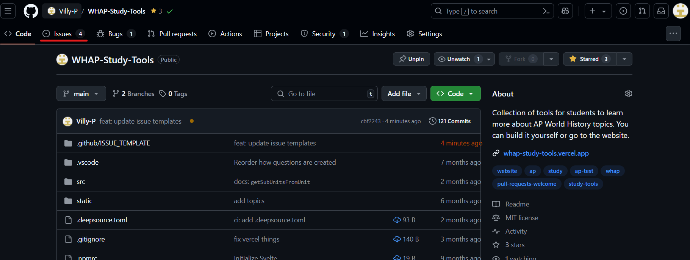
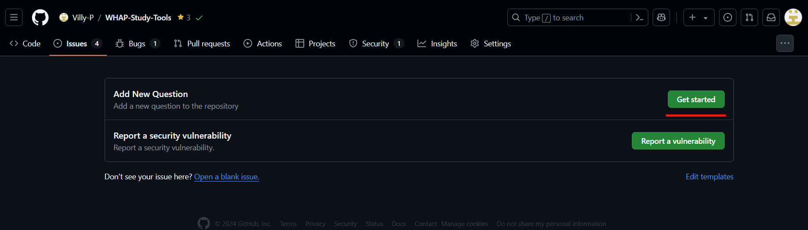
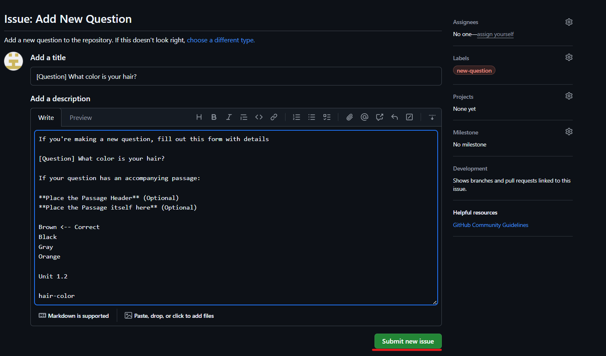

# Contributing

Thank you for deciding to contribute to WHAP Study Tools!

If you're making any changes to the codebase itself such as a bugfix or feature, fork the repo and open a PR!
If not, continue reading

## Contributing a Question

The goal of this repo is to be a place that contains dozens of user contributed questions so that students can study for World History.
There are multiple ways to do this:

### Opening an Issue

The easiest way to do this is by opening an issue. This way you don't need to fork the repo and make the changes, but can instead do everything in your browser, and we'll update the repo for you.

First, [go to the main URL](https://github.com/Villy-P/WHAP-Study-Tools) and click the **Issues** button at the top, then **New Issue**.

You can then select the **Add New Question** issue template

You'll then be prompted to make a new issue.
Add a title, then fill out the form with all the details
Take this example:

Once you're done, press **Submit New Issue**, and we'll get back to you about any changes you need to make.

If your question looks good then you don't need to do anything else! We'll handle adding the question and uploading it to the website. Thanks for the question!
