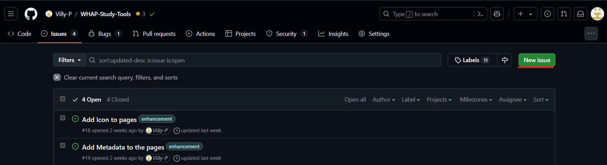

# Contributing

Thank you for deciding to contribute to WHAP Study Tools!

If you're making any changes to the codebase itself such as a bugfix or feature, fork the repo and open a PR!
If not, continue reading

## Contributing a Question

The goal of this repo is to be a place that contains dozens of user contributed questions so that students can study for World History.
There are multiple ways to do this:

### Opening an Issue

The easiest way to do this is by opening an issue. This way you don't need to fork the repo and make the changes, but can instead do everything in your browser, and we'll update the repo for you.

First, [go to the main URL](https://github.com/Villy-P/WHAP-Study-Tools) and click the **Issues** button at the top, then **New Issue**.




You can then select the **Add New Question** issue template


You'll then be prompted to make a new issue.
Add a title, then fill out the form with all the details
Take this example:


Once you're done, press **Submit New Issue**, and we'll get back to you about any changes you need to make.

If your question looks good then you don't need to do anything else! We'll handle adding the question and uploading it to the website. Thanks for the question!

### Forking the repo and adding the question manually

If you want to add your question directly to the codebase, you can create a PR and do it there.

This method is slower than opening an issue, but you can add multiple questions at once this way.

First, **fork** the repo:


> Your button will be clear and clickable. Just scroll to the bottom and select **Create Fork**

Then, think of the question you want to add, and specifically note the **unit** and **subunit**.

In the folder structure, navigate to `src/data`, the select the correct unit number and the subsequent subunit. For example, if you had a question in unit 1.2, you would navigate to `src/data/unit1/unit1.2.json`.

Then select the **edit** button.


You can use this JSON template to make your question (Make sure you delete any unused fields!):

``` json
{
    "question": "Question Goes here",
    "passage_header": "(Optional) Passage Header goes here",
    "passage": "(Optional) Passage content goes here"
    "image_link": "(Optional) Link to the image",
    "answers": [
        "Answer 1",
        "Answer 2",
        "Answer 3",
        "Answer 4"
    ],
    "answer": 1, // This corresponds to the index in the answers array. An answer of 1 means Answer 2 will be marked as the correct answer!
    "unit": 1,
    "subunit": 2,
    "topics": [
        "topic1",
        "topic2"
    ]
}
```

Heres an example of that item being added to the document:


Then, click **Commit Changes...** in the top-right corner and name your commit the question, then commit the changes.
After that, go back to the homepage at https://github.com/YOURUSERIDHERE/WHAP-Study-Tools and select the **Contribute** button below the green **Code** Button, then select **Open Pull Request**.

After that, title your pull request and click **Create Pull Request**

We'll review your changes and get back to you if anything needs changing (Check your email!). If not, we'll merge the PR and you can see your changes on the main branch. Thank You!

> If you decide to contrbute again, you DO NOT need to fork the repo again. Just go back to your forked repository and select edit on the file you want to add the question to, and follow the steps for opening a Pull Request
